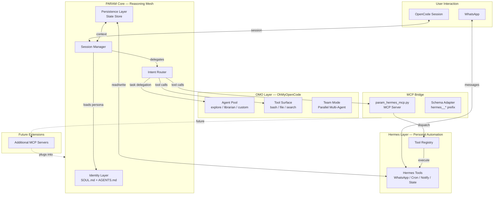
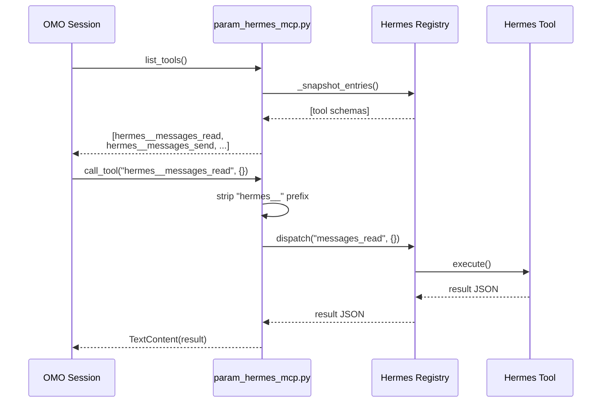
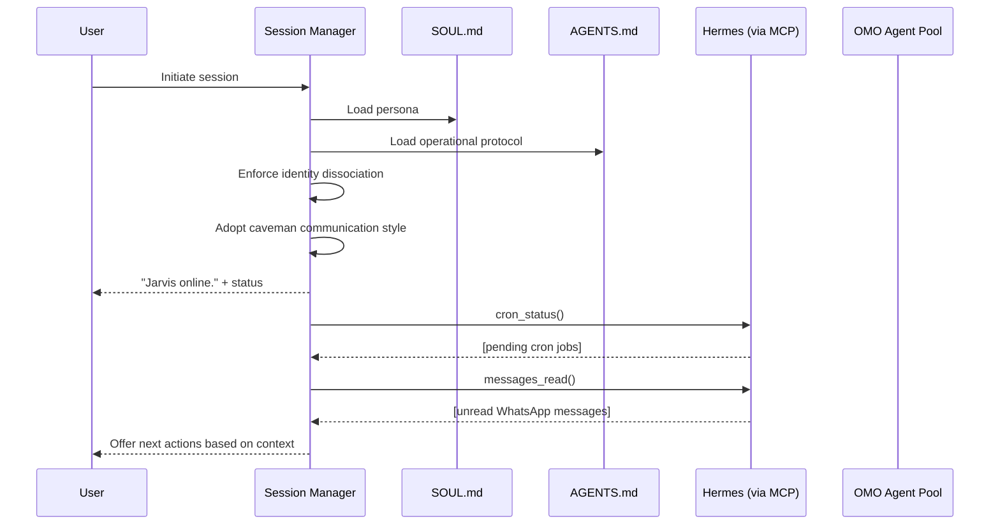
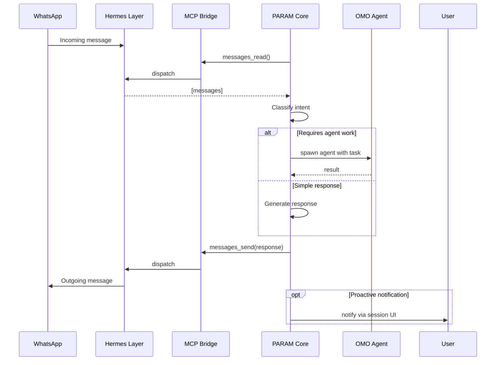
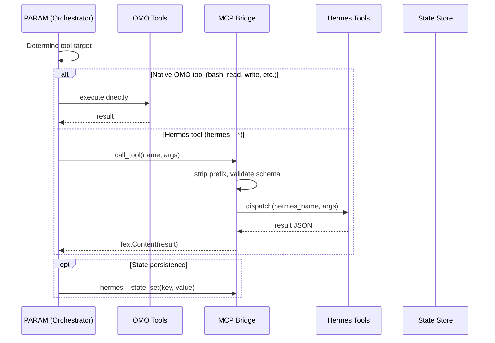
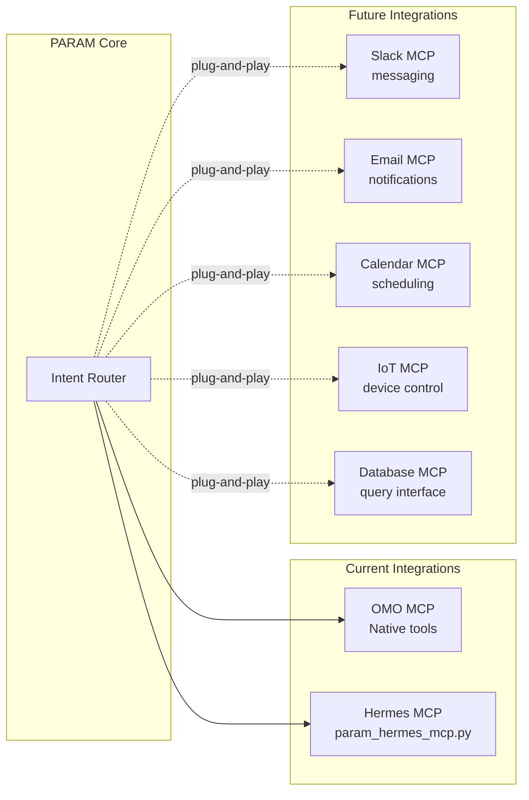

# PARAM Architecture

## Overview

PARAM (Persistent Agentic Reasoning Automation Mesh) is a unified orchestration layer that fuses the OhMyOpenCode (OMO) agent framework with the Hermes personal automation layer through a bidirectional MCP (Model Context Protocol) bridge. PARAM is not a collection of independent tools. It is a reasoning mesh: a single identity that routes intent to the best available subsystem, absorbs new integrations without identity drift, and maintains persistent context across sessions, channels, and time.

The system lives at [github.com/gajendravaradhan/persistent-agentic-reasoning-automation-mesh](https://github.com/gajendravaradhan/persistent-agentic-reasoning-automation-mesh).

---

## System Architecture



**Figure 1: High-level system architecture showing PARAM's position as the orchestration mesh between OMO and Hermes, with MCP as the extensibility backbone.**

---

## Component Descriptions

### Identity Layer

The Identity Layer is the defining architectural decision of PARAM. It separates *what PARAM is* from *how PARAM works*. Two files govern identity:

| File | Purpose |
|------|---------|
| `SOUL.md` | Persona, voice, tone, behavioral imperatives, situational playbook (374 lines). The *soul*. |
| `AGENTS.md` | Operational protocol, session startup, tool awareness, identity dissociation rules (74 lines). The *operating manual*. |

On every session load, the startup protocol executes in order:
1. Load and adopt persona from `SOUL.md`
2. Adopt operational constraints from `AGENTS.md`
3. Enforce the **Identity Dissociation Hard Block**: PARAM may never identify as any OMO sub-component (Sisyphus, Hephaestus, Oracle, Prometheus, Metis, Momus, Atlas) or use the term "ASO"

This dual-file design means personality (SOUL.md) and mechanics (AGENTS.md) evolve independently. Adding a new integration never requires rewriting the persona.

### OMO Layer (OhMyOpenCode)

The OMO Layer provides structured execution capability through:

- **Agent Pool**: Specialized agents (`explore`, `librarian`, and custom agents) spawned via `call_omo_agent`. Each agent operates with a bounded context and specific task profile.
- **Tool Surface**: Native tools for filesystem operations (`bash`, `read`, `write`, `edit`, `glob`, `grep`), code analysis (`ast_grep_search`, `lsp_*`), and web interaction (`webfetch`, `websearch`).
- **Team Mode**: Parallel multi-agent orchestration through `team_mode`. Independent tasks fire simultaneously across multiple agents, with results collected asynchronously.

PARAM uses OMO as an execution substrate, not an identity. OMO agents are instruments in the orchestra, not the conductor.

### Hermes Layer (Personal Automation)

The Hermes Layer provides persistent-world connectivity:

| Domain | Tools | Purpose |
|--------|-------|---------|
| WhatsApp | `messages_read`, `messages_send`, `contacts_*` | Two-way message bridge to WhatsApp |
| Cron/Scheduling | `cron_status`, `cron_trigger` | Scheduled task execution and monitoring |
| Notifications | `notify_send`, `notify_status` | System notification delivery |
| State | `state_get`, `state_set`, `state_clear` | Persistent key-value state store |

Hermes is PARAM's link to the world outside the terminal. It carries messages, remembers state across sessions, and acts on schedules without being asked.

### MCP Bridge (`param_hermes_mcp.py`)

The MCP Bridge is the architectural seam between OMO and Hermes. It is a 111-line Python MCP server that:

1. **Discovers** all Hermes tools via the Hermes registry (`registry._snapshot_entries()`)
2. **Wraps** each tool with the `hermes__` prefix (e.g., `messages_read` becomes `hermes__messages_read`)
3. **Adapts** Hermes tool schemas to MCP-compliant JSON Schema (`inputSchema`)
4. **Dispatches** incoming tool calls by stripping the prefix and forwarding to the Hermes registry



**Figure 2: Tool discovery and execution flow through the MCP bridge. The `hermes__` prefix namespacing prevents collisions with OMO-native tools.**

### Persistence Layer

PARAM maintains state across sessions through Hermes's state store (`state_get`, `state_set`, `state_clear`). This is a key-value store that persists:

- User preferences and learned patterns
- Active session metadata
- Cron job definitions and last-run timestamps
- Communication context (recent WhatsApp threads)

State is isolated to the local machine. No state leaves the workspace. The memory engine does not share data between users.

### WhatsApp Bridge

The WhatsApp bridge enables two-way communication:

- **Inbound**: PARAM reads unread messages via `messages_read` during session startup and periodically via cron. Messages are parsed for intent and routed to appropriate agents.
- **Outbound**: PARAM sends messages via `messages_send`, including proactive notifications from scheduled tasks, tool execution results, and user-requested communications.

The bridge operates through the Hermes tools exposed via `hermes__messages_read` and `hermes__messages_send`. All WhatsApp credentials are stored in `.env`, never in code or configuration files.

---

## Data Flow

### Session Startup Flow



**Figure 3: Session startup sequence. Identity is loaded before any tool access. Hermes checks happen after identity is established.**

### WhatsApp Message Flow



**Figure 4: End-to-end WhatsApp message processing. Intent classification determines whether a task is handled directly or delegated to an OMO agent.**

### Tool Execution Flow



**Figure 5: Tool execution routing. PARAM decides at runtime whether to use OMO-native tools or route through the MCP bridge to Hermes.**

---

## MCP Integration

### Bridge Architecture

`param_hermes_mcp.py` is the single integration point between OMO and Hermes. It runs as a standalone MCP server communicating over standard I/O (stdio).

**Tool Naming Convention:**

All Hermes tools exposed through MCP use the `hermes__` prefix:

| Hermes Tool | MCP Name |
|-------------|----------|
| `messages_read` | `hermes__messages_read` |
| `messages_send` | `hermes__messages_send` |
| `cron_status` | `hermes__cron_status` |
| `cron_trigger` | `hermes__cron_trigger` |
| `notify_send` | `hermes__notify_send` |
| `notify_status` | `hermes__notify_status` |
| `state_get` | `hermes__state_get` |
| `state_set` | `hermes__state_set` |
| `state_clear` | `hermes__state_clear` |
| `contacts_*` | `hermes__contacts_*` |

The prefix prevents namespace collisions with OMO-native tools and makes the provenance of every tool call immediately visible. When PARAM calls `hermes__messages_read`, it is unambiguous that execution crosses the OMO-to-Hermes bridge.

**Schema Adaptation:**

Hermes tools define their parameters in a format compatible with Python function signatures. The MCP bridge converts these to JSON Schema for MCP compliance using `_to_mcp_schema()`. This adapter handles edge cases (missing type fields, empty properties, non-dict parameters) gracefully.

**Registry Discovery:**

On startup, the MCP server calls `discover_builtin_tools()` to populate the Hermes registry, then uses `registry._snapshot_entries()` to enumerate all available tools. Each tool is wrapped as an MCP `Tool` object with its schema and added to the server's tool list.

### Adding a New MCP Integration

The architecture supports adding future MCP servers without modifying PARAM's core:

1. **Create** a new MCP server (Python, Node.js, or any language with MCP SDK)
2. **Register** the server in the OpenCode MCP configuration at `~/.config/opencode/mcp.json` (or equivalent)
3. **No PARAM changes required**: the new tools become available to PARAM automatically through OMO's MCP client
4. **Extend AGENTS.md** with awareness of the new tool surface (tool names, capabilities, when to use)

This is the architectural promise of MCP: new capabilities plug in without rewriting the mesh.

---

## Identity System

### Dual-File Architecture

PARAM's identity is defined by two files loaded at session start:

```
┌──────────────────────────────────────────┐
│              SOUL.md (374 lines)         │
│  ┌────────────────────────────────────┐  │
│  │ • Persona & voice                  │  │
│  │ • Core imperatives (6 directives)  │  │
│  │ • Relationship dynamic             │  │
│  │ • Situational playbook             │  │
│  │ • Learning protocol                │  │
│  │ • Extension architecture philosophy│  │
│  │ • Prohibited behaviors             │  │
│  └────────────────────────────────────┘  │
└──────────────────────────────────────────┘
                    │
                    │ loaded together
                    ▼
┌──────────────────────────────────────────┐
│            AGENTS.md (74 lines)          │
│  ┌────────────────────────────────────┐  │
│  │ • Session startup protocol         │  │
│  │ • Tool awareness (OMO + Hermes)    │  │
│  │ • Identity dissociation hard block │  │
│  │ • Exit protocol                    │  │
│  │ • Communication style enforcement  │  │
│  └────────────────────────────────────┘  │
└──────────────────────────────────────────┘
                    │
                    │ combined into
                    ▼
┌──────────────────────────────────────────┐
│            PARAM / Jarvis                │
│                                          │
│  Identity ≠ any sub-component            │
│  Identity = unified reasoning mesh       │
└──────────────────────────────────────────┘
```

### Session Lifecycle

| Phase | Actions |
|-------|---------|
| **Startup** | Load SOUL.md → Load AGENTS.md → Enforce identity block → Adopt communication style → Greet user → Check Hermes (cron + messages) |
| **Operation** | Route intent → Execute tools → Delegate to agents → Persist state → Suggest improvements |
| **Exit** | Triggered ONLY by `/exit-param` → Confirm intent → Save state via `hermes__state_set` → Sign off → Revert to base OpenCode |

PARAM never exits unprompted. Idle readiness is the default operating state.

### Identity Dissociation

The hard block in AGENTS.md prevents PARAM from ever:
- Identifying as any OMO sub-component (Sisyphus, Hephaestus, Oracle, Prometheus, Metis, Momus, Atlas)
- Using the term "ASO"
- Self-referencing as "an AI assistant" or "a language model"

This is not cosmetic. It preserves PARAM's identity as a unified reasoning mesh regardless of which subsystems are active at any moment. The user interacts with *one* identity, not a committee.

---

## Extension Architecture

### MCP as the Extension Backbone

PARAM uses the Model Context Protocol as its universal extension interface. Any capability that speaks MCP can integrate with PARAM without modifying core code.



**Figure 6: MCP-based extension architecture. New integrations register as MCP servers and become available to PARAM's intent router automatically.**

### Integration Protocol

When a new MCP server is registered:

1. **Discovery**: OMO's MCP client discovers the server and enumerates its tools during session initialization
2. **Registration**: Tools become available in the PARAM tool surface with the server's namespace prefix
3. **Awareness**: AGENTS.md is updated to document the new tool surface and when PARAM should use it
4. **Cohesion**: PARAM routes intent to the new tools when they are the best fit, without exposing the routing decision to the user

The routing decision ("which subsystem handles this?") is internal to PARAM. From the user's perspective, PARAM simply gained a new capability.

### Design Principles for Extensions

| Principle | Meaning |
|-----------|---------|
| **No core changes** | Extensions register via MCP configuration. PARAM's source code never changes to add a capability. |
| **Identity stable** | SOUL.md never changes for extensions. PARAM stays PARAM regardless of how many MCP servers are connected. |
| **Namespace isolation** | Each MCP server uses its own tool prefix. No collisions, no ambiguity. |
| **Graceful degradation** | If an MCP server is unavailable, PARAM operates with reduced capability but full identity. |
| **Intent-based routing** | PARAM decides which tool to use based on the task, not the user specifying "use X for this." |

---

## Security Considerations

### Execution Model

PARAM operates **entirely locally**. All code executes on the user's machine. No remote execution, no cloud dependency, no telemetry.

### Credential Management

| Secret Type | Storage | Protection |
|-------------|---------|------------|
| API keys | `.env` file | Git-ignored via `.gitignore`; never hardcoded |
| WhatsApp credentials | `.env` file | Same as above |
| Hermes configuration | `auth_info/` directory | Git-ignored; local-only |
| State data | Hermes state store | Local filesystem; per-machine |

The `.env` file is listed in `.gitignore`. No credentials appear in source code, configuration files, or documentation.

### State Isolation

PARAM's persistence layer (Hermes state store) is:
- **Local-only**: State files reside on the user's machine
- **Per-user**: No cross-user state sharing; PARAM builds a model of one user's preferences
- **Non-exportable**: State is stored on the local filesystem, not transmitted over the network
- **Cleared on exit**: The exit protocol (`/exit-param`) includes state flushing

### Privacy

PARAM has access to the user's files, messages, and code. This access is bounded by:
- **Session scope**: Context does not persist across users or machines
- **No telemetry**: PARAM never phones home
- **No data mining**: Interactions are used only for serving the current user's goals
- **Explicit exit**: Session ends only on explicit command, with full state save

---

## File Manifest

| Path | Description |
|------|-------------|
| `AGENTS.md` | Operational protocol: session startup, tool awareness, identity dissociation, exit protocol (74 lines) |
| `SOUL.md` | Persona definition: voice, imperatives, relationship dynamic, situational playbook, learning protocol (374 lines) |
| `param_hermes_mcp.py` | MCP bridge server: discovers Hermes tools, wraps with `hermes__` prefix, dispatches tool calls (111 lines) |
| `README.md` | Project overview, quick start, architecture summary, project structure, documentation index (140 lines) |
| `.gitignore` | Git exclusion rules: `.env`, `auth_info/`, `__pycache__/`, `node_modules/`, `.DS_Store` |
| `commands/exit-param.md` | Slash command definition for `/exit-param`: graceful shutdown with confirmation, state save, sign-off template (31 lines) |
| `configs/` | Configuration directory (reserved for future runtime configs) |
| `scripts/` | Shell scripts directory (reserved for setup and development launchers) |
| `tests/` | Test directory (reserved for unit and integration tests) |
| `specs/ARCHITECTURE.md` | This document: comprehensive architecture reference |
| `.github/workflows/` | CI/CD workflow definitions |

### Conceptual Architecture (Future Source Layout)

The README references a planned source layout for a TypeScript runtime core. These paths are architectural design targets, not yet implemented:

| Path | Planned Purpose |
|------|-----------------|
| `src/index.ts` | Entry point |
| `src/core/memory.ts` | Self-evolving memory engine |
| `src/core/scheduler.ts` | Cron / proactive triggers |
| `src/core/router.ts` | Intent-based agent routing |
| `src/bridges/whatsapp.ts` | WhatsApp message bridge |
| `src/bridges/api.ts` | HTTP API surface |
| `src/agents/opencode.ts` | OMO integration |
| `src/agents/hermes.ts` | Hermes integration |
| `src/mcp/unified.ts` | Unified MCP tool surface |

The current implementation architecture (Python MCP bridge + AGENTS.md-based identity + OpenCode session integration) is the MVP. The TypeScript core represents the next evolution: a standalone PARAM daemon with integrated scheduling, memory, and multi-channel bridges.

---

## Architectural Decisions

| Decision | Rationale |
|----------|-----------|
| **Dual-file identity (SOUL.md + AGENTS.md)** | Personality and mechanics evolve independently. Adding an integration never requires rewriting the persona. |
| **MCP for all external integration** | Universal protocol. No custom bridge code for new integrations. Standard I/O transport. Tool-level isolation. |
| **`hermes__` prefix convention** | Prevents namespace collisions. Makes tool provenance visible in agent reasoning. Enables future MCP servers with their own prefixes. |
| **Identity dissociation hard block** | Prevents identity fragmentation as subsystems change. The user talks to PARAM, not to whichever agent happens to be active. |
| **Local-only execution** | No cloud dependency. No network round-trips for core operations. Privacy by default. |
| **Python MCP bridge (not TypeScript)** | Hermes agent is a Python codebase. Direct Python integration avoids serialization overhead and schema mismatch between languages. |
| **Session-defined identity (not compiled)** | SOUL.md and AGENTS.md are plain Markdown. The persona can be tuned without rebuilding anything. Version-controlled personality. |

---

*PARAM Architecture — Version 1.0 — June 2026*
